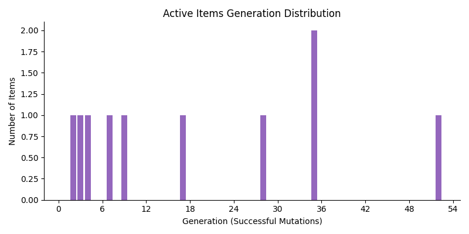
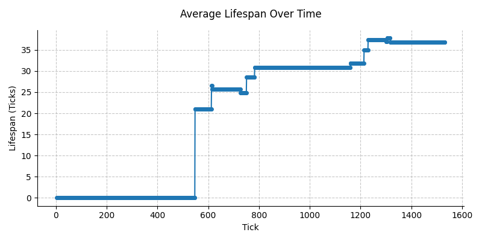
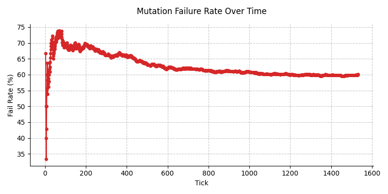
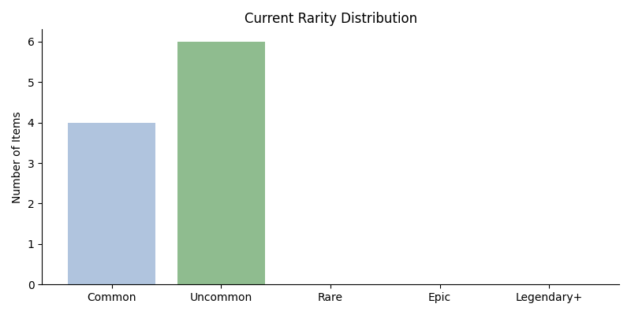
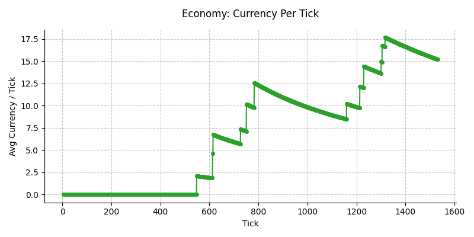

For the actual documentation, see [docs](docs/).

# World state overview

## Latest Tick
1532

## Oldest Item
Dread Focus of Blood

## Ecosystem Summary
- Active Items: 10
- Average Rarity: 2.11
- Average Volatility: 0.42
- Average Durability: 52.73

## Dominant Factions
- STR: 0.8
- Order: 0.6
- Stability: 0.6

## Extremes
- Most Stable Item: Glacial Relic of Frost
- Most Volatile Item: Titanic Edge of Gales

## Recent Events
- STABLE: 'Glacial Relic of Frost' did not mutate this tick.
- STABLE: 'Glacial Rapier of Might' did not mutate this tick.
- STABLE: 'Glacial Rapier of Might' did not mutate this tick.

## Lifecycle Stats
- Items Created: 22
- Items Archived: 12
- Avg Lifespan (ticks): 36.8

### Distribution chart

### Average lifespan line chart

## Mutation Stats (Last Tick)
- Mutations Attempted: 1532
- Successful Mutations: 612
- Failure Rate: 60.1%

## Rarity Distribution
- Common: 6
- Uncommon: 3
- Rare: 1
- Epic: 0
- Legendary+: 0

## Economy
- Total Currency: 23300
- Currency per Tick (avg): 15.21
- Recent Gains: 0

