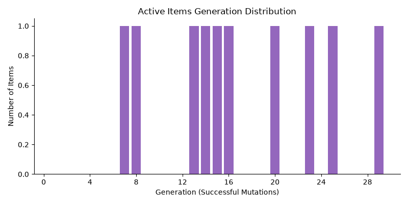
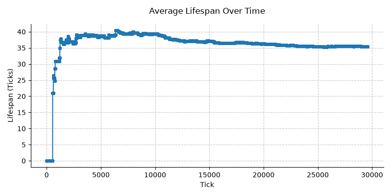
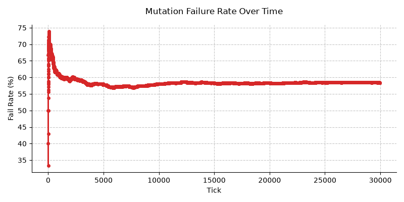
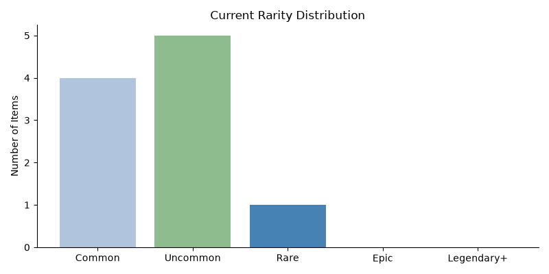
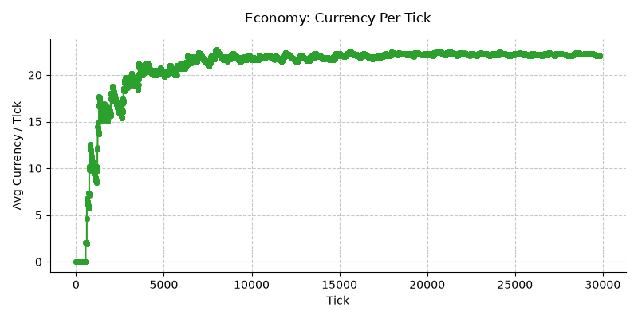

For the actual documentation, see [docs](docs/).

# World state overview

## Latest Tick
23032

## Oldest Item
Ancient Spear of Iron

## Ecosystem Summary
- Active Items: 10
- Average Rarity: 1.4
- Average Volatility: 0.34
- Average Durability: 68.28

## Dominant Factions
- Stability: 0.7
- STR: 0.4
- DEX: 0.4

## Extremes
- Most Stable Item: Ancient Spear of Iron
- Most Volatile Item: Mundane Rapier of Might

## Recent Events
- STABLE: 'Zealous Rapier of Grace' did not mutate this tick.
- MUTATED: 'Vampiric Blade of Frost' evolved to generation 28.
- REPLACED WITH: 'Ancient Spear of Iron' (5e0fd687-07f5-4ac8-9bce-596ca011a64b)

## Lifecycle Stats
- Items Created: 283
- Items Archived: 273
- Avg Lifespan (ticks): 35.6

### Distribution chart

### Average lifespan line chart

## Mutation Stats (Last Tick)
- Mutations Attempted: 23032
- Successful Mutations: 9551
- Failure Rate: 58.5%

## Rarity Distribution
- Common: 7
- Uncommon: 3
- Rare: 0
- Epic: 0
- Legendary+: 0

## Economy
- Total Currency: 513900
- Currency per Tick (avg): 22.31
- Recent Gains: 1500

