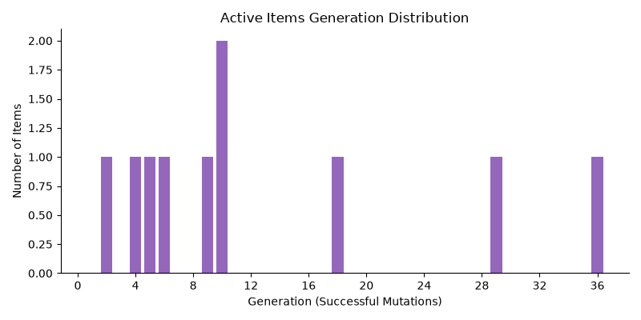
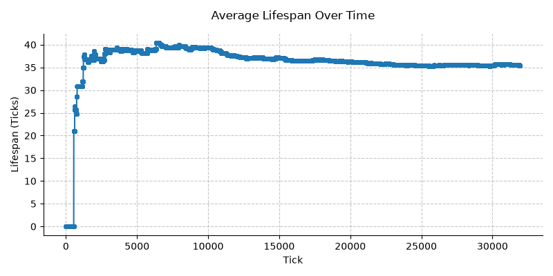
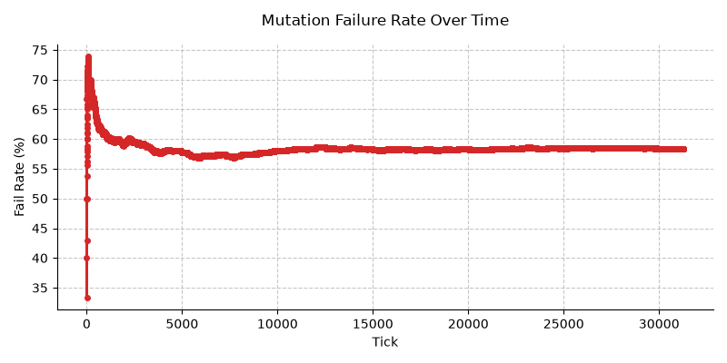
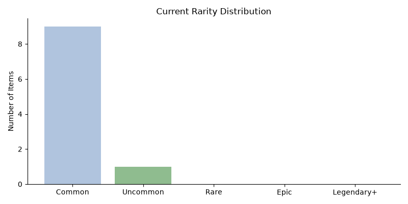
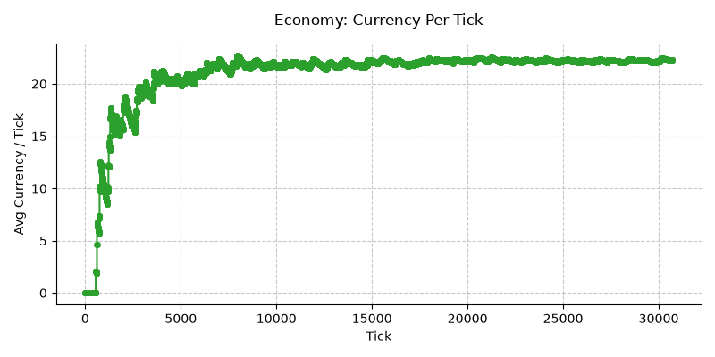

For the actual documentation, see [docs](docs/).

# World state overview

## Latest Tick
31632

## Oldest Item
Mundane Rapier of Might

## Ecosystem Summary
- Active Items: 10
- Average Rarity: 1.7
- Average Volatility: 0.37
- Average Durability: 62.27

## Dominant Factions
- Stability: 0.4
- STR: 0.3
- Restoration: 0.2

## Extremes
- Most Stable Item: Blessed Bow of Ruins
- Most Volatile Item: Resolute Axe of the Void

## Recent Events
- MUTATED: 'Shattered Rapier of Might' evolved to generation 13.
- STABLE: 'Blessed Bow of Ruins' did not mutate this tick.
- STABLE: 'Blessed Bow of Ruins' did not mutate this tick.

## Lifecycle Stats
- Items Created: 388
- Items Archived: 378
- Avg Lifespan (ticks): 35.5

### Distribution chart

### Average lifespan line chart

## Mutation Stats (Last Tick)
- Mutations Attempted: 31632
- Successful Mutations: 13153
- Failure Rate: 58.4%

## Rarity Distribution
- Common: 7
- Uncommon: 3
- Rare: 0
- Epic: 0
- Legendary+: 0

## Economy
- Total Currency: 708700
- Currency per Tick (avg): 22.4
- Recent Gains: 0

