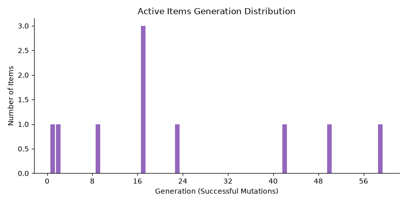

For the actual documentation, see [docs](docs/).

# World state overview

## Latest Tick
36132

## Oldest Item
Mundane Sigil of the Phoenix

## Ecosystem Summary
- Active Items: 10
- Average Rarity: 1.38
- Average Volatility: 0.41
- Average Durability: 69.19

## Dominant Factions
- DEX: 0.5
- STR: 0.4
- Order: 0.4

## Extremes
- Most Stable Item: Fractured Blade of Gales
- Most Volatile Item: Mortal Bow of Carnage

## Recent Events
- STABLE: 'Mundane Focus of Frost' did not mutate this tick.
- MUTATED: 'Mortal Bow of Carnage' evolved to generation 14.
- STABLE: 'Mortal Bow of Carnage' did not mutate this tick.

## Lifecycle Stats
- Items Created: 442
- Items Archived: 432
- Avg Lifespan (ticks): 35.5

### Distribution chart

### Average lifespan line chart

## Mutation Stats (Last Tick)
- Mutations Attempted: 36132
- Successful Mutations: 14995
- Failure Rate: 58.5%

## Rarity Distribution
- Common: 8
- Uncommon: 2
- Rare: 0
- Epic: 0
- Legendary+: 0

## Economy
- Total Currency: 808950
- Currency per Tick (avg): 22.39
- Recent Gains: 0

